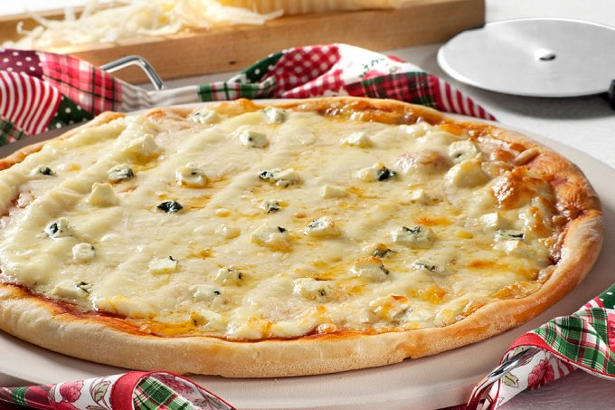

<!-- Readme doc: https://github.com/othneildrew/Best-README-Template#roadmap -->

<!-- PROJECT SHIELDS -->
<!--
*** I'm using markdown "reference style" links for readability.
*** Reference links are enclosed in brackets [ ] instead of parentheses ( ).
*** See the bottom of this document for the declaration of the reference variables
*** for contributors-url, forks-url, etc. This is an optional, concise syntax you may use.
*** https://www.markdownguide.org/basic-syntax/#reference-style-links
-->
[![Contributors][contributors-shield]][contributors-url]
[![Forks][forks-shield]][forks-url]
[![Stargazers][stars-shield]][stars-url]
[![Issues][issues-shield]][issues-url]
[![MIT License][license-shield]][license-url]
[![LinkedIn][linkedin-shield]][linkedin-url]

<!-- PROJECT LOGO -->
<br />
<p align="center">
  <a href="https://github.com/rafaelqueiroz88/FamigliaSalernoFinal">
    
  </a>

  <h3 align="center">Famíglia Salerno</h3>

  <p align="center">
    Que tal conhecer mais este projeto?
    <br />
    <a href="https://github.com/rafaelqueiroz88/FamigliaSalernoFinal"><strong>Explorar »</strong></a>
    <br />
    <br />
    <a href="https://famigliasalernodelivery.herokuapp.com/">Click aqui para ver uma demonstração</a>
    ·
    <a href="https://github.com/rafaelqueiroz88/FamigliaSalernoFinal/issues">Reportar Bug</a>
    ·
    <a href="https://github.com/rafaelqueiroz88/FamigliaSalernoFinal/issues">Envie uma ideia</a>
  </p>
</p>

<!-- TABLE OF CONTENTS -->
<details open="open">
  <summary>Conteúdo</summary>
  <ol>
    <li>
      <a href="#about-the-project">Acerca do projeto</a>
      <ul>
        <li><a href="#built-with">Tecnologias</a></li>
      </ul>
    </li>
    <li>
      <a href="#getting-started">Iniciando a Aplicação</a>
      <ul>
        <li><a href="#prerequisites">Requisitos</a></li>
        <li><a href="#installation">Instação</a></li>
      </ul>
    </li>
    <li><a href="#usage">Como utilizar</a></li>
    <li><a href="#roadmap">Progresso</a></li>
    <li><a href="#contributing">Contribuição</a></li>
    <li><a href="#license">Licença</a></li>
    <li><a href="#contact">Contatos</a></li>
    <li><a href="#acknowledgements">Base de conhecimento</a></li>
  </ol>
</details>

<!-- ABOUT THE PROJECT -->
## Acerca do Projeto

<!-- [![Product Name Screen Shot][product-screenshot]](https://example.com) -->

Existem hoje inumeras soluções voltadas para o mercado da gastronomia. Porém, é muito comum que os recursos disponíveis não necessáriamente vão atender a todas as necessidades do usuário, uma vez que este mercado é muito flexível. Não existe uma fórmula mágica do sucesso.

Assim como o mercado gastronomico, as aplicações desenvolvidas para o segmento, não necessariamente será capaz de atender com perfeição todos usuários. Muitas vezes encontramos muita solução para pouca tarefa, ou muita tarefa para pouca solução.

Sendo assim, fez-se necessário o desenvolvimento de uma aplicação com todos os recursos necessários para atender a um cliente específico. A Famíglia Salerno.


### Tecnologias

Nesta sessão, temos acesso a todas as tecnologias utilizadas no projeto. Saiba mais sobre cada uma delas:
* [Ruby](https://rubyonrails.org/)
* [Ruby on Rails](https://www.ruby-lang.org/pt/)
* [React](https://pt-br.reactjs.org/)
* [Sidekiq](https://sidekiq.org/)
* [Redis](https://redis.io/)
* [Docker](https://www.docker.com/)
* [Postgresql](https://www.postgresql.org/)


<!-- GETTING STARTED -->
## Como utilizar

Para levantar a aplicação basta iniciar o docker-compose

### Requisitos

Algumas bibliotecas estão sendo utilizadas pelo Ruby on Rails. Para fazer a instalação basta seguir com o comando:

* ruby
  ```sh
  bundle install
  ```

### Instalação

1. Clone o repositório
   ```sh
   git clone https://github.com/rafaelqueiroz88/FamigliaSalernoFinal
   ```
2. Instale as bibliotecas necessárias
   ```sh
   bundle install
   ```


<!-- USAGE EXAMPLES -->
## Como utilizar

Basta abrir um navegador de sua preferência, e acessar a seguinte URL: localhost:3000

<!-- _For more examples, please refer to the [Documentation](https://example.com)_ -->

<!-- ROADMAP -->
## Progresso

Veja [open issues](https://github.com/rafaelqueiroz88/FamigliaSalernoFinal/issues) para ver a lista de features sugeridas.


<!-- CONTRIBUTING -->
## Contribuição

Contribuições fazem com que nossas aplicações sejam sempre melhores. Neste caso não é diferente. Caso queira compartilhar seu conhecimento basta seguir os passos. **Sua ajuda será muito apreciada por nós!**.

1. Crie um Fork do projeto
2. Crie a sua própria branch (`git checkout -b feature/AmazingFeature`)
3. Escreva uma commit de suas alterações (`git commit -m 'Add new feature'`)
4. Envie as atualizações para a Branch (`git push origin feature/AmazingFeature`)
5. Abra uma Pull Request para enviar suas sugestões de alteração


<!-- LICENSE -->
## Licença

Distribuído sobre a licença MIT License. Veja `LICENSE` para mais informações.


<!-- CONTACT -->
## Contato

Rafael Queiroz - [@your_facebook](https://www.facebook.com/rafael.queiroz.castro/) - rafael.qdc88@gmail.com

Projeto: [https://github.com/your_username/repo_name](https://github.com/rafaelqueiroz88/FamigliaSalernoFinal)


<!-- ACKNOWLEDGEMENTS -->
## Base de conhecimento
* [GitHub Emoji Cheat Sheet](https://www.webpagefx.com/tools/emoji-cheat-sheet)
* [Img Shields](https://shields.io)
* [Choose an Open Source License](https://choosealicense.com)
* [GitHub Pages](https://pages.github.com)
* [Animate.css](https://daneden.github.io/animate.css)
* [Loaders.css](https://connoratherton.com/loaders)
* [Slick Carousel](https://kenwheeler.github.io/slick)
* [Smooth Scroll](https://github.com/cferdinandi/smooth-scroll)
* [Sticky Kit](http://leafo.net/sticky-kit)
* [JVectorMap](http://jvectormap.com)
* [Font Awesome](https://fontawesome.com)


<!-- MARKDOWN LINKS & IMAGES -->
<!-- 
  https://github.com/rafaelqueiroz88/FamigliaSalernoFinal
-->
<!-- https://www.markdownguide.org/basic-syntax/#reference-style-links -->
[contributors-shield]: https://img.shields.io/github/contributors/rafaelqueiroz88/FamigliaSalernoFinal.svg?style=for-the-badge
[contributors-url]: https://github.com/rafaelqueiroz88/FamigliaSalernoFinal/graphs/contributors
[forks-shield]: https://img.shields.io/github/forks/rafaelqueiroz88/FamigliaSalernoFinal?style=for-the-badge
[forks-url]: https://github.com/rafaelqueiroz88/FamigliaSalernoFinal/network/members
[stars-shield]: https://img.shields.io/github/stars/rafaelqueiroz88/FamigliaSalernoFinal?style=for-the-badge
[stars-url]: https://github.com/rafaelqueiroz88/FamigliaSalernoFinal/stargazers
[issues-shield]: https://img.shields.io/github/issues/rafaelqueiroz88/FamigliaSalernoFinal.svg?style=for-the-badge
[issues-url]: https://github.com/rafaelqueiroz88/FamigliaSalernoFinal/issues
[license-shield]: https://img.shields.io/github/license/rafaelqueiroz88/FamigliaSalernoFinal.svg?style=for-the-badge
[license-url]: https://github.com/rafaelqueiroz88/FamigliaSalernoFinal/blob/master/LICENSE.txt
[linkedin-shield]: https://img.shields.io/badge/-LinkedIn-black.svg?style=for-the-badge&logo=linkedin&colorB=555
[linkedin-url]: https://www.linkedin.com/in/rafael-queiroz-0074a4139/
<!-- [product-screenshot]: images/screenshot.png -->